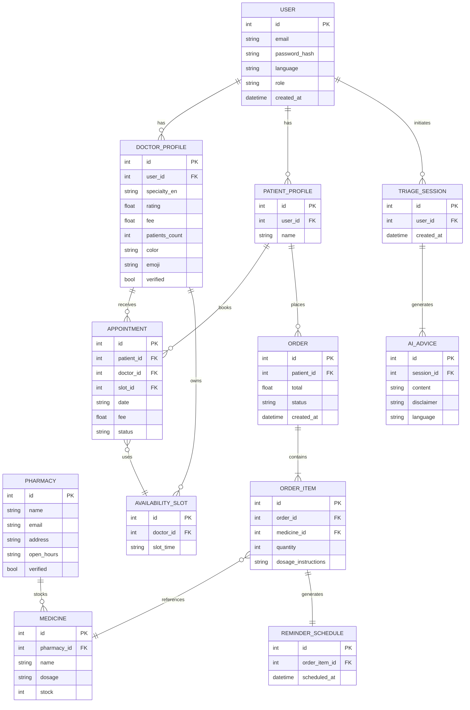
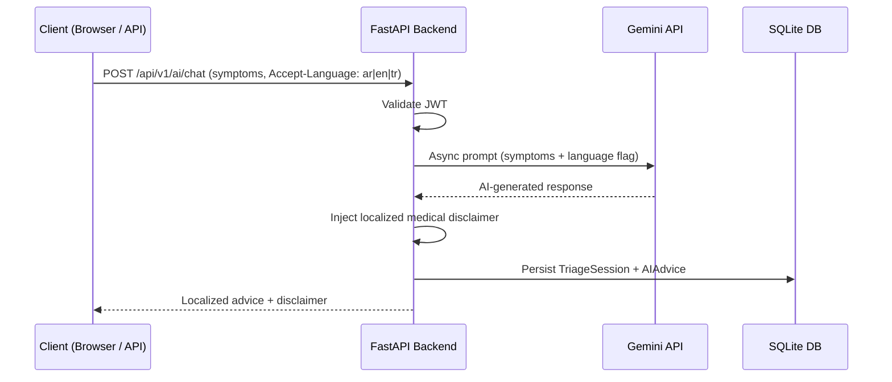
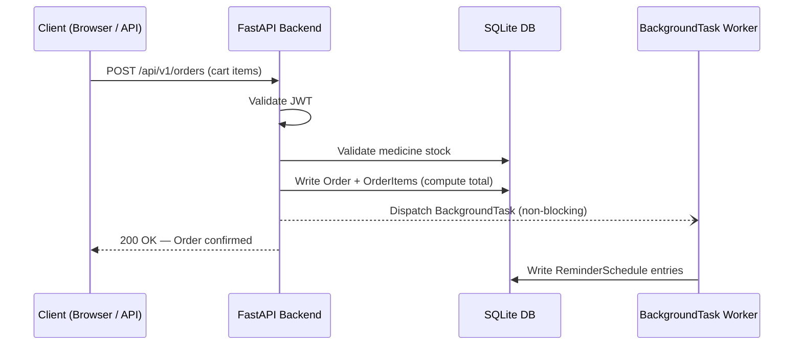
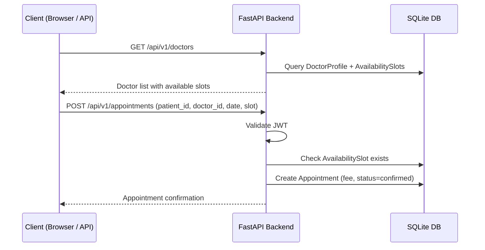
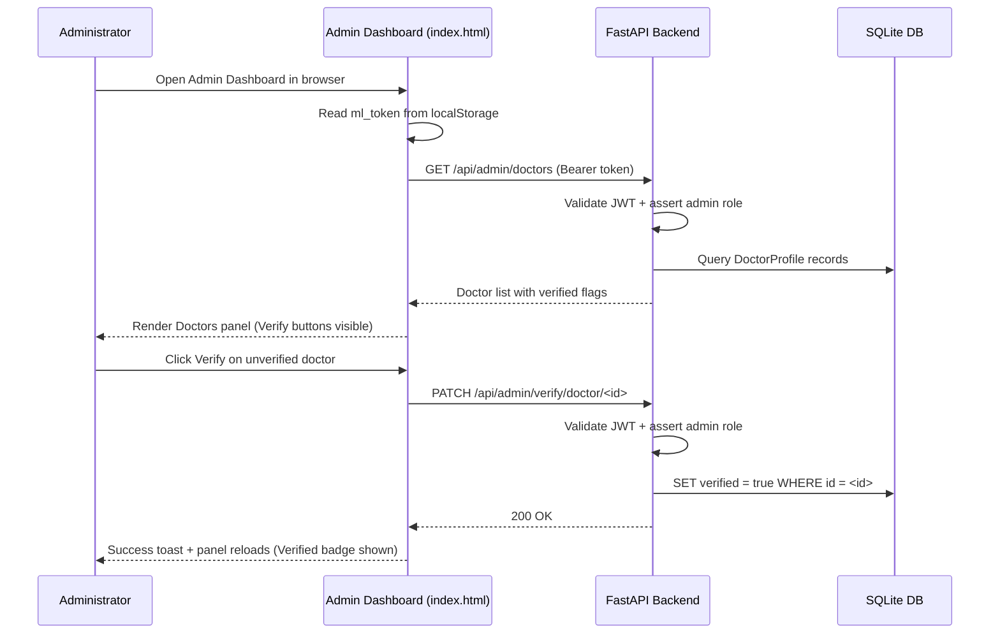
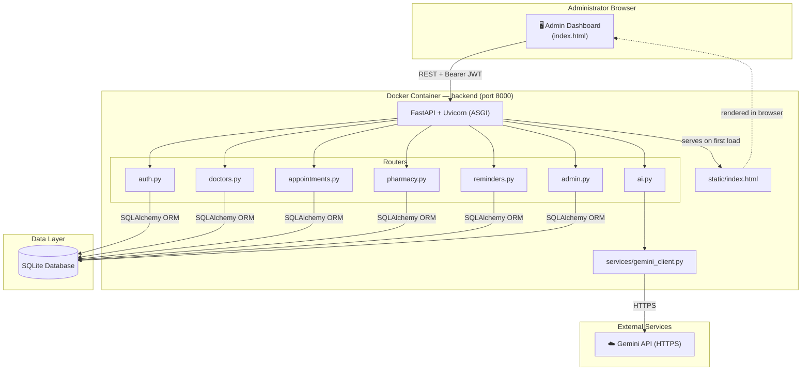

# MedLinka — Software Architecture Document

> **Audience guide:** Sections 1–4 are for all readers. Section 5 (Logical View) targets end-users and business stakeholders. Section 6 (Process View) targets system integrators and performance engineers. Section 7 (Development View) targets developers and project managers. Section 8 (Physical View) targets system engineers and DevOps. Section 9 (Scenarios) is for all readers and serves as validation of the architecture.

---

## Change History

| Version | Date | Author | Description |
|---------|------|--------|-------------|
| 1.0 | 2026-04-10 | MedLinka Team | Initial release — 4+1 architecture integration for FastAPI stack |
| 1.1 | 2026-04-26 | MedLinka Team | Added Admin Dashboard (static HTML); introduced Pharmacy entity, Admin role, verification workflow, and `/admin/*` API surface |
| 1.2 | 2026-04-26 | MedLinka Team | Removed mobile client from scope; replaced all image-based diagrams with inline Mermaid diagrams |

---

## Table of Contents

1. Scope
2. References
3. Software Architecture Overview
4. Architectural Goals and Constraints
5. Logical View
6. Process View
7. Development View
8. Physical View
9. Scenarios
10. Size and Performance
11. Quality

---

## 1. Scope

MedLinka addresses the difficulty many people face when accessing affordable healthcare. Physical distance from hospitals, cost barriers, and lack of digital health tools leave many patients without timely care. MedLinka is a multilingual platform (Arabic, Turkish, English) that bridges patients and medical resources by centralizing three core services: AI-assisted symptom triage, doctor consultation booking, and pharmacy ordering.

**What MedLinka covers:**
- Static HTML Admin Dashboard (`index.html`) for platform administrators to monitor platform activity and verify doctors and pharmacies.
- RESTful API backend for user registration, profile management, and multilingual support.
- AI-powered symptom analysis via the Gemini API.
- Doctor consultation scheduling with time-slot management.
- Medicine catalogue browsing, ordering, and prescription tracking.
- Admin-controlled verification workflow for doctors and pharmacies.

**What MedLinka explicitly does not cover:**
- Real-time hardware sensor integration or external health device synchronization.
- In-person hospital management or electronic health record (EHR) interoperability.
- Payment processing (marked [TBD] for a future release).
- A dedicated patient-facing client application (deferred to a future release).

This document follows the Kruchten 4+1 Architectural View Model.

---

## 2. References

| # | Title | Source |
|---|-------|--------|
| R1 | Architectural Blueprints — The "4+1" View Model of Software Architecture | Philippe Kruchten, IEEE Software, Vol. 12 No. 6, November 1995 |
| R2 | SWE 332 Software Architecture — Course Material | Semester 2025–2026 |
| R3 | FastAPI Official Documentation | https://fastapi.tiangolo.com/ |

---

## 3. Software Architecture Overview

MedLinka is designed as a modular, API-first system. The architecture cleanly separates the client interface (Admin Dashboard) from the backend business logic and data storage (FastAPI + SQLite).

The fundamental architectural strategy is **API-driven modular decomposition**. Each major domain — auth, triage, consultation, pharmacy, admin, and reminders — is implemented as a separate FastAPI router/module. External dependencies (like the Gemini AI API) are wrapped behind dedicated service classes, ensuring that the core business logic remains independent of third-party SDKs.

### 3.1 Architectural Style

The system follows a **layered client-server** style utilizing asynchronous I/O:
- **Client:** A standalone static HTML Admin Dashboard (`index.html`) served directly by the backend and accessed through any web browser by platform administrators.
- **Server:** A FastAPI application running on Uvicorn (ASGI), providing RESTful endpoints (`/api/v1/...` for application routes and `/api/admin/...` for administrative routes).
- **Processing:** The server processes requests asynchronously, utilizing FastAPI's `BackgroundTasks` for non-blocking operations like sending medication reminders.

### 3.2 Correspondence Between Views

| Logical category | Process task | Development module | Physical node |
|------------------|-------------|-------------------|---------------|
| `User`, `Doctor`, `Admin` | Async request handling | `backend/routers/auth.py` | Docker App Container |
| `AIAdvice` | API call + Disclaimer injection | `backend/routers/ai.py` | Docker App → Gemini API |
| `Consultation` | Synchronous booking transaction | `backend/routers/appointments.py` | Docker App → SQLite DB |
| `Order`, `Cart` | Synchronous order transaction | `backend/routers/pharmacy.py` | Docker App → SQLite DB |
| `Pharmacy` | Entity management + verification | `backend/routers/pharmacy.py` | Docker App → SQLite DB |
| `ReminderTask` | FastAPI `BackgroundTask` | `backend/routers/reminders.py` | Docker App (Background) |
| `AdminStats`, `Verification` | Admin-only aggregation + PATCH | `backend/routers/admin.py` | Docker App → SQLite DB |

---

## 4. Architectural Goals and Constraints

### 4.1 Quality Goals (Priority Order)

| Priority | Quality Attribute | Description | Measurable target |
|----------|------------------|-------------|-------------------|
| 1 | Security / Privacy | Health data must be protected | JWT authentication; HTTPS enforced; PII secured; admin routes protected by role check. |
| 2 | Performance | High concurrency handling | Fast I/O operations utilizing FastAPI's async capabilities. |
| 3 | Modifiability | Easy swap of UI and AI providers | Separation of concerns (Static Admin HTML / FastAPI / SQLite). |
| 4 | Usability | Multilingual support | RTL (Arabic) and LTR (English, Turkish) support at the API layer via `Accept-Language`. |

### 4.2 Constraints
- **Framework:** Python / FastAPI required for the backend.
- **Timeline:** One academic semester limits scope (payment processing and patient-facing client deferred).
- **Infrastructure:** Dockerized environment for easy local testing and eventual cloud deployment.
- **Admin Dashboard:** Served as a self-contained static HTML file to avoid an additional frontend build pipeline.

---

## 5. Logical View

> **Reader:** End-users, business stakeholders, and developers.

The logical view describes the object-oriented decomposition of MedLinka, organized around functional bounded contexts.

### 5.1 Class Categories and Responsibilities

**Category 1 — Identity, Roles & Localization (`users`)**
- `User`: Base class storing credentials, language preference (`ar`, `en`, `tr`), and role (`patient`, `admin`).
- `DoctorProfile`: Extension of the user model for medical professionals; includes `specialty_en`, `rating`, `fee`, `patients_count`, `color`, `emoji`, and a `verified` flag managed by admins.
- `PatientProfile`: Extension of the user model for patients.
- `Admin`: Privileged role granting access to the `/api/admin/*` surface and the Admin Dashboard UI.

**Category 2 — AI Triage (`ai_triage`)**
- `TriageSession`: Represents an AI chat conversation.
- `AIAdvice`: Stores Gemini AI output, including the mandatory medical disclaimer.

**Category 3 — Consultation (`appointments`)**
- `AvailabilitySlot`: A named time window on a doctor's calendar (e.g., `"10:00 AM"`).
- `Appointment`: Links a patient to an availability slot on a specific date; carries `fee` and `status` (`confirmed`, `pending`, etc.).

**Category 4 — Pharmacy (`pharmacy` & `orders`)**
- `Pharmacy`: A registered pharmacy entity with `name`, `email`, `address`, `open_hours`, and a `verified` flag managed by admins.
- `Medicine`: Catalogue item associated with a pharmacy (name, dosage, stock).
- `Order` / `OrderItem`: Created upon checkout; `Order` carries a computed `total` field visible in admin reports.

**Category 5 — Reminders (`reminders`)**
- `ReminderSchedule`: Generated from an `OrderItem` to alert the patient automatically.

**Category 6 — Admin Reporting (`admin`)**
- `AdminStats`: A read-only aggregate that surfaces platform-wide counts (users, doctors, appointments, orders, revenue) and recent activity snapshots for the Admin Dashboard Overview panel.

### 5.2 Key Relationships
- `User` has one-to-many `TriageSession`s.
- `Appointment` links exactly one `PatientProfile` and one `DoctorProfile` to one `AvailabilitySlot`.
- `Order` contains many `OrderItem`s; its `total` is the sum of item prices.
- `OrderItem` generates exactly one `ReminderSchedule`.
- `Admin` can verify (set `verified = true`) on any `DoctorProfile` or `Pharmacy` via `PATCH /api/admin/verify/{type}/{id}`.
- `Pharmacy` contains many `Medicine` catalogue entries.

---

### 5.3 Database Schema Diagram (ERD)



---

## 6. Process View

> **Reader:** System integrators and performance engineers.

### 6.1 Process Flow and Concurrency

MedLinka utilizes Python's asynchronous ecosystem (ASGI/Uvicorn) to handle high concurrency without the overhead of heavy threads.

---

**Flow A — AI Triage (Synchronous API with Async I/O)**

1. Client sends `POST /api/v1/ai/chat` with symptom text and an `Accept-Language` header.
2. FastAPI validates the JWT token.
3. FastAPI awaits the Gemini API call asynchronously (non-blocking).
4. The response is processed, a localized legal disclaimer is injected, and the result is returned.



---

**Flow B — Order Checkout & Reminders (Background Tasks)**

1. Client sends `POST /api/v1/orders`.
2. FastAPI validates stock and writes the `Order` (with computed `total`) to SQLite.
3. A `BackgroundTask` is dispatched without blocking the HTTP response.
4. The client immediately receives a success response.
5. The background worker writes `ReminderSchedule` entries to the database.



---

**Flow C — Doctor Booking**

1. Client fetches available doctors and their slots.
2. Client submits a booking with patient, doctor, date, and slot details.
3. FastAPI creates the `Appointment` record and returns confirmation.



---

**Flow D — Admin Verification**

1. Admin opens the dashboard in a browser; the page reads a JWT from `localStorage`.
2. The dashboard fetches the target panel (doctors or pharmacies).
3. Admin triggers a verification action.
4. FastAPI validates the admin role and sets `verified = true` on the target record.
5. The dashboard refreshes and confirms with a toast notification.



---

### 6.2 Fault Tolerance
- **AI Failure:** If Gemini times out, the backend catches the exception and returns a localized standard error ("AI unavailable, please consult a doctor").
- **Database Locks:** SQLite handles concurrent reads well, but writes are sequential. FastAPI's async ORM interactions ensure the event loop is not blocked during I/O.
- **Admin Auth Failure:** If the Admin Dashboard receives a `401` from any `/api/admin/*` or `/api/pharmacy` endpoint, it automatically displays a warning toast and redirects to the application root (`/`) after two seconds, preventing unauthorized access.

---

## 7. Development View

> **Reader:** Developers and project managers.

### 7.1 Layer Hierarchy & Repository Structure

The repository is divided strictly by tier to allow independent development of the admin dashboard and the backend.

```text
medlinka/
├── backend/                  # Layer 2: Server (FastAPI + SQLite)
│   ├── routers/              # API endpoints
│   │   ├── auth.py           #   Registration & login
│   │   ├── doctors.py        #   Doctor profiles
│   │   ├── ai.py             #   AI triage (delegates to services/)
│   │   ├── appointments.py   #   Booking & slot management
│   │   ├── pharmacy.py       #   Medicine catalogue, orders, pharmacy entities
│   │   ├── reminders.py      #   Background reminder scheduling
│   │   └── admin.py          #   Stats, entity lists, verification actions
│   ├── models/               # SQLAlchemy DB models & Pydantic schemas
│   ├── services/             # External integrations
│   │   └── gemini_client.py  #   Gemini API wrapper
│   ├── static/               # Served as static files by FastAPI
│   │   └── index.html        #   Self-contained Admin Dashboard
│   ├── main.py               # Application entry point
│   └── requirements.txt
└── docker-compose.yml        # Layer 0: Infrastructure
```

### 7.2 Design Rules

1. **Localization First:** All error messages and AI prompts must dynamically respect the `Accept-Language` header (`ar`, `tr`, `en`).
2. **API Versioning:** All patient-facing endpoints must be prefixed with `/api/v1/`. Admin endpoints use `/api/admin/`. Pharmacy entity management uses `/api/pharmacy`.
3. **Decoupled AI:** The `routers/ai.py` must never import Gemini directly; it must use `services/gemini_client.py`.
4. **Role Enforcement:** All `/api/admin/*` routes must validate that the JWT bearer holds the `admin` role before processing the request.
5. **Admin Dashboard Auth:** The `index.html` dashboard reads its token from `localStorage` (`ml_token`) and forwards it as a `Bearer` token on every request. Any `401` response triggers an automatic redirect to `/`.

---

## 8. Physical View

> **Reader:** System engineers and DevOps.

### 8.1 Deployment Configuration (Dockerized)

The current environment is containerized using Docker Compose for seamless local deployment and testing.

| Node / Container | Software | Role |
|------------------|----------|------|
| `backend` | Python 3.11 + FastAPI + Uvicorn | API server on port `8000`; also serves `static/index.html` as the Admin Dashboard |
| `database` | SQLite (mounted volume) | Persistent data storage |

**External Dependencies:**
- **Gemini API:** Accessed via outbound HTTPS from the `backend` container.

---

### 8.2 System Architecture Diagram

> Shows how all physical nodes, containers, and external services connect to each other.



---

### 8.3 API Endpoints Map

> A full map of all exposed REST endpoints and their purpose.

```
BASE URL: http://localhost:8000/api/

Authentication
  POST   /v1/auth/register            --> Register new user
  POST   /v1/auth/login               --> Login, receive JWT token

Doctors
  GET    /v1/doctors                  --> List all doctors
  GET    /v1/doctors/<id>             --> Get single doctor by ID

Patients
  GET    /v1/patients                 --> List all patients
  GET    /v1/patients/<id>            --> Get single patient by ID

Appointments
  GET    /v1/appointments             --> List all appointments (with names)
  GET    /v1/appointments/<id>        --> Get single appointment by ID
  POST   /v1/appointments             --> Book a new appointment
                                          Body: { patient_id, doctor_id, appointment_date, slot }

Pharmacy
  GET    /v1/pharmacy/medicines       --> Browse medicine catalogue
  POST   /v1/orders                   --> Submit a cart / place an order
  GET    /pharmacy                    --> List all registered pharmacies
                                          Returns: { pharmacies: [{ id, name, email,
                                                      address, open_hours, verified }] }

AI Triage
  POST   /v1/ai/chat                  --> Send symptoms, receive AI advice
                                          Header: Accept-Language: ar | en | tr

Admin  (JWT bearer with admin role required on all routes below)
  GET    /admin/stats                 --> Platform overview: user count, doctor count,
                                          appointment count, order count, total revenue,
                                          recentUsers[], recentOrders[]
  GET    /admin/users                 --> List all registered patients
  GET    /admin/doctors               --> List all doctors with verification status,
                                          rating, fee, specialty, color, emoji
  GET    /admin/appointments          --> List all appointments with patient/doctor names,
                                          slot, fee, and status
  GET    /admin/orders                --> List all orders with patient name, items[],
                                          total, status, and date
  PATCH  /admin/verify/doctor/<id>    --> Set doctor verified = true
  PATCH  /admin/verify/pharmacy/<id>  --> Set pharmacy verified = true
```

---

## 9. Scenarios

### 9.1 Scenario A — Multilingual AI Triage
1. A Turkish patient authenticates via `POST /api/v1/auth/login` and receives a JWT.
2. The client sends symptoms to `POST /api/v1/ai/chat` with the header `Accept-Language: tr`.
3. The FastAPI router passes the prompt and language flag to `services/gemini_client.py`.
4. Gemini processes the request. The backend appends a Turkish medical disclaimer before returning.
5. The client receives and displays the localized AI advice.

### 9.2 Scenario B — Medicine Order
1. A patient browses `GET /api/v1/pharmacy/medicines` and submits a cart to `POST /api/v1/orders`.
2. FastAPI validates the stock, computes the `total`, and commits the order to SQLite.
3. A `BackgroundTask` is triggered to schedule medication reminders based on the `OrderItem` dosage instructions.
4. The client immediately receives a success response without waiting for the reminder scheduling to complete.

### 9.3 Scenario C — Admin Verifies a Doctor
1. A platform administrator opens the Admin Dashboard (`/static/index.html`) in a browser.
2. The dashboard reads the JWT from `localStorage` (`ml_token`) and loads the **Doctors** panel via `GET /api/admin/doctors`.
3. An unverified doctor appears in the table with a **Verify** button.
4. The admin clicks **Verify**; the dashboard sends `PATCH /api/admin/verify/doctor/<id>`.
5. FastAPI validates the admin role from the JWT, sets `verified = true`, and returns a success response.
6. The dashboard displays a green toast ("✓ doctor verified successfully") and reloads the panel — the entry now shows the "Verified" badge.

### 9.4 Scenario D — Admin Verifies a Pharmacy
1. The administrator navigates to the **Pharmacies** panel, which fetches `GET /api/pharmacy`.
2. An unverified pharmacy is listed with a **Verify** button.
3. The admin clicks **Verify**; `PATCH /api/admin/verify/pharmacy/<id>` is sent.
4. FastAPI updates the pharmacy record and the dashboard refreshes the panel, now showing the "Verified" badge.

---

## 10. Size and Performance

- **Codebase:** A single Python backend ecosystem. The Admin Dashboard is one self-contained static HTML file requiring no build step.
- **Performance Target:** FastAPI guarantees sub-100ms response times for database reads (e.g., listing doctors, fetching admin stats). AI triage response time is bounded by Gemini network latency.
- **Data:** SQLite is used for zero-config deployment. If traffic exceeds SQLite's write capacity, the ORM (SQLAlchemy) allows switching to PostgreSQL with minimal code changes.

---

## 11. Quality

- **Security:** Passwords are hashed using bcrypt. The API relies on stateless JWTs. Admin-only endpoints enforce role validation on every request; the Admin Dashboard enforces the same JWT requirement client-side and redirects to `/` on `401`.
- **Medical Safety:** The AI system is heavily sandboxed. Every AI response includes a non-bypassable medical disclaimer injected at the backend layer, regardless of which client made the request.
- **Verification Integrity:** Doctors and pharmacies can only be marked as `verified` through the authenticated admin workflow; no other endpoint can modify this flag.
- **Multilingual API:** Language-sensitive logic (AI prompts, error messages, disclaimers) is driven by the `Accept-Language` header, keeping the API client-agnostic.

---

## Appendix A — Design Principles and Rationale

| Decision | Alternatives considered | Chosen approach | Rationale |
|----------|------------------------|-----------------|-----------|
| Backend Framework | Django, Flask | **FastAPI** | Superior async performance, automatic Swagger UI docs (`/docs`), and native type checking with Pydantic. |
| AI Provider | OpenAI, Vertex AI | **Gemini** | Highly capable multilingual processing, cost-effective for the academic/startup phase. |
| Database | PostgreSQL | **SQLite** | Zero-configuration needed for local dev via Docker. SQLAlchemy makes future migration to Postgres trivial. |
| Async Tasks | Celery + Redis | **FastAPI BackgroundTasks** | Keeps infrastructure simple (no extra containers needed) while still preventing HTTP blocking. |
| Admin Dashboard | React+Vite SPA (separate container) | **Static HTML (`index.html`)** | Eliminates a dedicated Node.js build pipeline and frontend container. A single self-contained file is sufficient for internal admin tooling and reduces operational overhead. |
